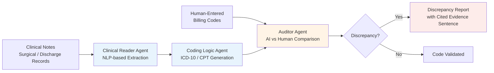

# System Architecture

This diagram is a **recreation** of the system design our team proposed and built, drawn independently for documentation purposes — it is not a screenshot or reproduction of any internal Virtusa or hackathon-organizer material.

## Component Breakdown

### 1. Clinical Reader Agent
- Ingests unstructured clinical notes (surgical notes, discharge summaries)
- Uses NLP-based entity extraction to identify diagnoses, procedures, and comorbidities
- Outputs structured clinical entities for downstream coding

### 2. Coding Logic Agent
- Maps extracted clinical entities to ICD-10 (diagnosis) and CPT (procedure) codes
- Applies a configurable rules engine to handle coding logic, edge cases, and comorbidity-driven code adjustments

### 3. Auditor Agent
- Compares AI-generated codes against the codes a human coder actually billed
- Flags discrepancies (missed comorbidities, undercoding, potential upcoding risk)
- Links every flag to the **exact sentence** in the source clinical note that justifies it — this evidence-linking is what makes the audit trail explainable rather than a black-box score

## Design Principles

- **Explainability first** — every automated decision must be traceable to source text, since this is a compliance-sensitive domain
- **Pre-submission validation** — the system is designed to run before claims go out, not as a post-hoc audit
- **API-first, modular agents** — each agent has a defined interface so components can be swapped or extended independently

## Tech Stack (as built for the hackathon demo)

| Layer | Technology |
|---|---|
| Backend | FastAPI |
| Interface | Streamlit |
| NLP | Clinical text extraction pipeline (entity/discrepancy detection) |
| Architecture | Multi-agent, API-first, designed for cloud-scalable / FHIR-compliant extension |

## What's Not in This Repo

The production implementation (model weights, prompts, rules-engine configuration, and the FastAPI/Streamlit source) belongs to Virtusa Consulting Services Pvt Ltd as part of the internship engagement and is not reproduced here. This documentation describes the design and my contribution to it.
